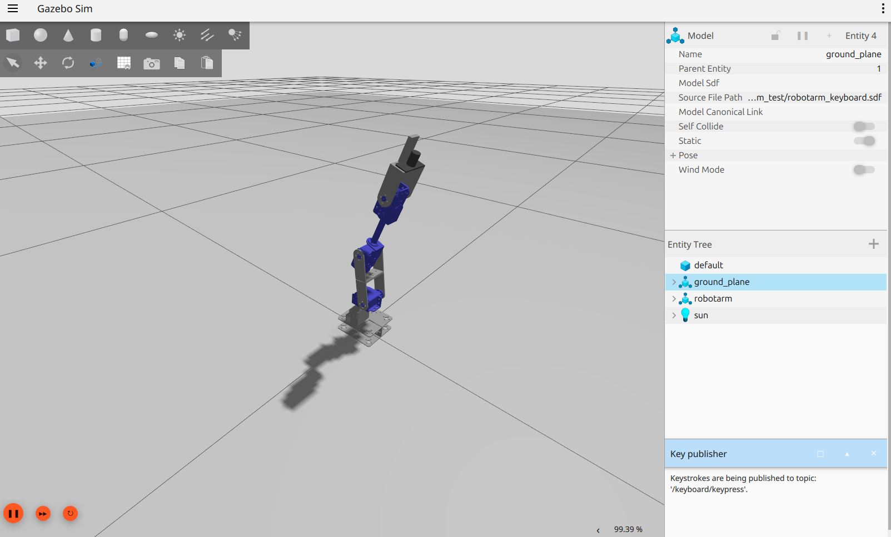

## custom robot arm 으로 지정된 아르코 마커로 누르기

- [1단계 ](#1단계)

- [문의하기](#문의)

## 1단계
- 3D 모델링 → URDF 작성 → SDF 변환 → `cmd_vel`로 간단 조작  
### [체험 코드](gz_arm_test/readme.md)

---

## 2단계

---

### 문의
[jongbob1918@gmail.com](mailto:jongbob1918@gmail.com)